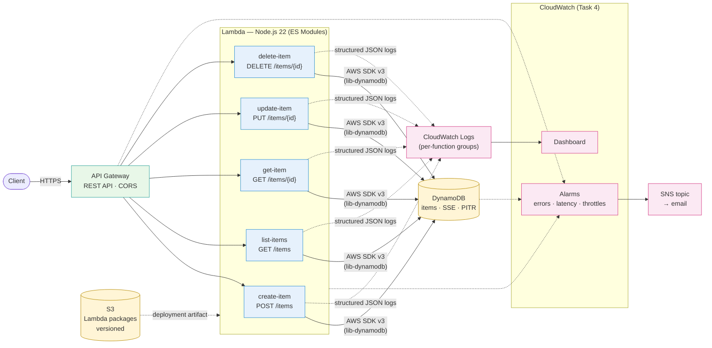

# Vistra Serverless REST API

Infrastructure as Code for a serverless CRUD API on AWS, built with Terraform and Node.js 22.

## What This Project Does

Provisions a complete serverless REST API stack:

- **API Gateway** REST API with five CRUD endpoints for `/items`
- **Lambda** functions (Node.js 22, ES Modules) with structured JSON logging
- **DynamoDB** table with encryption at rest and point-in-time recovery
- **S3** bucket for versioned Lambda deployment packages
- **EventBridge** for domain events and scheduled background processing
- **CloudWatch** dashboards, alarms, and structured logging
- **GitHub Actions** for validation, security scanning, and documentation linting

No AWS credentials are required. All code validates locally using `terraform validate` and `terraform fmt`.

---

## Architecture



_Task 5 (EventBridge + scheduled processor + DLQ) is intentionally not implemented in this submission._

---

## Project Structure

```text
├── .github/workflows/                # CI/CD pipelines
│   ├── terraform-validate.yaml       #   Terraform fmt + init + validate
│   ├── lambda-build.yaml             #   Node.js build, syntax check, packaging
│   ├── security-scan.yaml            #   Checkov infrastructure security scan
│   └── docs-lint.yaml                #   Markdown linting and link checks
│
├── infra/                            # Terraform root module
│   ├── main.tf                       #   Module composition (wires everything)
│   ├── variables.tf                  #   Root input variables with validation
│   ├── outputs.tf                    #   Key resource IDs and API endpoint
│   ├── versions.tf                   #   Provider and Terraform constraints
│   ├── locals.tf                     #   Naming conventions, function map, tags
│   ├── iam-roles.tf                  #   Lambda execution roles and policies
│   └── modules/
│       ├── api-gateway/              #   REST API, methods, CORS, deployment
│       │   ├── main.tf
│       │   ├── integrations.tf       #     Lambda proxy integrations
│       │   ├── locals.tf
│       │   ├── variables.tf
│       │   ├── outputs.tf
│       │   ├── versions.tf
│       │   └── modules/route/        #     Reusable route sub-module
│       ├── lambda/                   #   Functions, archiving, log groups
│       │   ├── main.tf
│       │   ├── archiving.tf          #     Source-to-zip packaging
│       │   ├── files/                #     Built Lambda .zip artifacts
│       │   ├── variables.tf
│       │   ├── outputs.tf
│       │   └── versions.tf
│       ├── dynamodb/                 #   Items table, encryption, PITR
│       ├── storage/                  #   S3 bucket, versioning, lifecycle
│       └── monitoring/               #   Dashboard, alarms, SNS notifications
│           ├── main.tf
│           ├── dashboard.tf          #     CloudWatch dashboard
│           ├── api-gateway-alarms.tf
│           ├── lambda-alarms.tf
│           ├── dynamodb-alarms.tf
│           ├── locals.tf
│           ├── variables.tf
│           ├── outputs.tf
│           └── versions.tf
│
├── src/handlers/                     # Node.js 22 Lambda function source (committed)
│   ├── create-item.mjs               #   POST /items
│   ├── list-items.mjs                #   GET /items
│   ├── get-item.mjs                  #   GET /items/{id}
│   ├── update-item.mjs               #   PUT /items/{id}
│   ├── delete-item.mjs               #   DELETE /items/{id}
│   ├── package.json                  #   ES Module config, SDK v3 dependencies
│   ├── package-lock.json
│   ├── biome.json                    #   Biome lint/format config
│   ├── README.md
│   └── utils/
│       ├── dynamodb.mjs              #   DynamoDB document client singleton
│       ├── logger.mjs                #   Structured JSON logger
│       ├── response.mjs              #   HTTP response builder with CORS
│       └── validator.mjs             #   Input validation helpers
│
├── docs/                             # Per-task design documentation
│   ├── task-2.md                     #   Lambda handlers + API Gateway design rationale
│   ├── task-3.md                     #   CI/CD pipeline strategy and trade-offs
│   └── task-4.md                     #   Monitoring strategy, alarms, Insights queries
│
├── scripts/
│   ├── tf-fmt.sh                     #   Terraform formatting check
│   ├── tf-validate.sh                #   Terraform fmt-check + init + validate
│   ├── node-validate.sh              #   Node.js syntax check
│   └── api-call.sh                   #   Smoke-test deployed API endpoints
│
├── .markdownlint.json
├── .gitignore
├── assignment.md                    # assignment description
└── README.md 
```

### Why This Structure

**Separation of infrastructure and application code.** `infra/` and `src/` are independent concerns with different change cadences. Terraform modules change when infrastructure evolves; Lambda handlers change when business logic evolves. Keeping them apart means CI/CD pipelines can scope their triggers (`paths:` filters) and developers can reason about changes in isolation.

**Modules by AWS service, not by feature.** Each module owns one logical AWS resource group (e.g., `api-gateway/` owns the REST API, methods, integrations, and deployment). This aligns with how AWS permissions, quotas, and documentation are organised, making it easy for engineers to find and modify infrastructure. The alternative — feature-based modules like `crud-api/` that bundle Lambda + API Gateway + DynamoDB — creates tight coupling and makes reuse harder.

**Shared utilities in `utils/`.** The logger, response builder, validator, and DynamoDB client are shared across all handlers. Duplicating them per-handler would create maintenance burden and inconsistency. The `utils/` directory is packaged into every Lambda deployment ZIP.

**Optional modules via feature flags.** Monitoring modules are gated behind `enable_monitoring` boolean variables. This keeps the core stack minimal while allowing progressive enhancement. The `count` meta-argument on the module block conditionally includes them.

### Per-Task Documentation

The [docs/](docs/) directory contains one design document per assignment task. Each covers the _why_ — strategy, trade-offs, and decisions — rather than restating what the code does.

- **[docs/task-2.md](docs/task-2.md)** — Lambda handler design, API Gateway integration, validation and response contracts, IAM scoping for the CRUD module.
- **[docs/task-3.md](docs/task-3.md)** — CI/CD pipeline shape, ordering rationale (fail fast on cheapest signal), security scanning trade-offs, deterministic Lambda packaging.
- **[docs/task-4.md](docs/task-4.md)** — Monitoring strategy (symptom-based alarming), metric/threshold rationale, dashboard design, CloudWatch Insights queries for triage.

Task 1 rationale lives in this README (project structure + key architectural decisions). Task 5 is not implemented.

## API Endpoints

| Method | Path | Description | Status Codes |
| ------ | ---- | ----------- | ------------ |
| `POST` | `/items` | Create a new item | 201, 400, 500 |
| `GET` | `/items` | List items (paginated) | 200, 400, 500 |
| `GET` | `/items/{id}` | Get item by ID | 200, 400, 404, 500 |
| `PUT` | `/items/{id}` | Update item by ID | 200, 400, 404, 500 |
| `DELETE` | `/items/{id}` | Delete item by ID | 200, 400, 404, 500 |

All endpoints return JSON with CORS headers. Request bodies are validated; malformed JSON or missing required fields return 400 with detailed error messages.

---

## Key Architectural Decisions

### Shared IAM Role for CRUD Lambdas

All five CRUD handlers share one execution role because they require identical permissions (CloudWatch Logs + DynamoDB table). Per-function roles would add complexity without security benefit. If a future handler needs different permissions, it gets its own role.

### Pre-Created CloudWatch Log Groups

Lambda auto-creates log groups without retention policies, leading to unbounded log storage costs. Terraform pre-creates log groups with configurable retention (default 30 days), and the Lambda resource depends on them to avoid race conditions.

### PAY_PER_REQUEST DynamoDB Billing

On-demand billing eliminates capacity planning for a new API with unknown traffic patterns. The trade-off (slightly higher per-request cost) is acceptable until traffic stabilises, at which point switching to provisioned mode is a single variable change.

---

## Validating the Code Locally

No AWS credentials needed. The scripts in [scripts/](scripts/) run the same checks as CI — see [docs/task-3.md](docs/task-3.md) for the full strategy.

**Prerequisites:** Terraform ≥ 1.6, Node.js 22.x, `jq`, `zip`.

```bash
./scripts/tf-fmt.sh        # auto-fix HCL formatting
./scripts/tf-validate.sh   # fmt-check + init (no backend) + validate
./scripts/node-validate.sh        # ES-module conventions, syntax, packaging
./scripts/api-call.sh             # optional: smoke-test a deployed API
```

A non-zero exit from any script means CI will fail on the same check.
